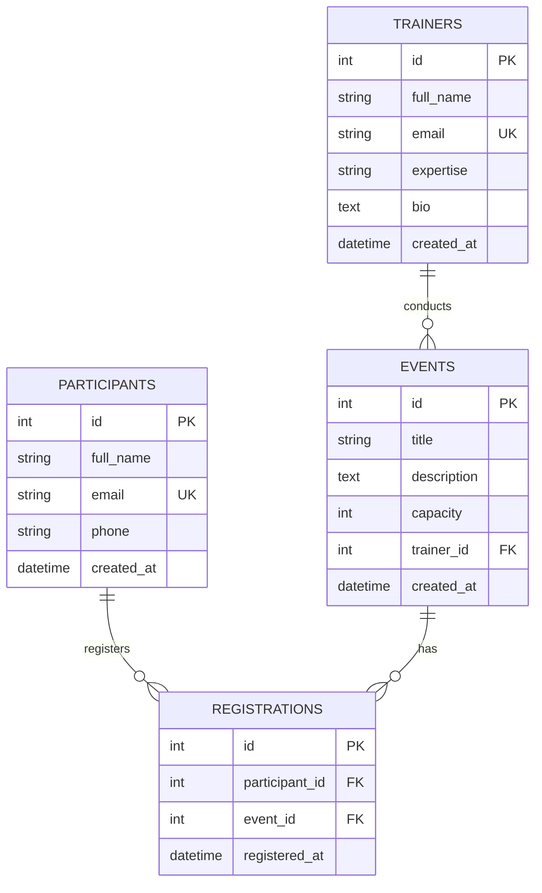

# Event Management Platform

Python FastAPI project implementing:
- SQL CRUD with SQLAlchemy ORM
- MongoDB logs and feedback collections
- Dockerized runtime with Docker Compose
- GitHub Actions CI/CD
- Pytest unit, API, and DB integration tests

## Tech Stack
- Python + FastAPI
- SQLAlchemy ORM
- SQL DB: PostgreSQL (Docker) or SQLite (local)
- MongoDB for logs
- Docker + Docker Compose
- GitHub Actions
- Pytest + coverage

## Modules Implemented

### Participants
- Register participant
- Update profile
- Delete participant
- View participants
- Register participant for event

### Trainers
- Add trainer
- Assign trainer to event
- View trainer sessions
- Update trainer profile

### Events
- Create event
- Update event
- Delete event
- Manage event capacity

### MongoDB Logging
- `event_logs`
- `user_activity_logs`
- `feedback_comments`
- CRUD-style create/list APIs for logs and feedback

## SQL Schema
- `participants`
- `trainers`
- `events`
- `registrations` (many-to-many between participants and events)

## ER Diagram


## Local Setup
1. Create and activate virtual environment.
2. Install dependencies:
   ```bash
   pip install -r requirements.txt
   ```
3. Copy `.env.example` to `.env` and adjust values.
4. Run the API:
   ```bash
   uvicorn app.main:app --reload
   ```
5. Open docs: `http://127.0.0.1:8000/docs`

## Alembic Migration
```bash
alembic -c db/alembic.ini upgrade head
```

## Docker
1. Create `.env` from `.env.example`
2. Run:
   ```bash
   docker compose up --build
   ```
3. API is available at `http://localhost:8000`

## API Endpoints (JSON REST)
- `GET /health`
- `POST /participants`
- `GET /participants`
- `PUT /participants/{participant_id}`
- `DELETE /participants/{participant_id}`
- `POST /participants/{participant_id}/register/{event_id}`
- `POST /trainers`
- `GET /trainers`
- `PUT /trainers/{trainer_id}`
- `POST /trainers/{trainer_id}/assign/{event_id}`
- `GET /trainers/{trainer_id}/sessions`
- `POST /events`
- `GET /events`
- `PUT /events/{event_id}`
- `PATCH /events/{event_id}/capacity`
- `DELETE /events/{event_id}`
- `POST /logs/events`
- `GET /logs/events`
- `POST /logs/activities`
- `GET /logs/activities`
- `POST /logs/feedback`
- `GET /logs/feedback`
- `PUT /logs/{collection}/{doc_id}`
- `DELETE /logs/{collection}/{doc_id}`

`{collection}` supports: `events`, `activities`, `feedback`.

## Testing
Run:
```bash
pytest
```
This executes:
- Unit-level service behavior via dependency overrides
- API endpoint tests
- SQL integration tests using in-memory SQLite
- Coverage report in terminal

## CI/CD (GitHub Actions)
Workflow file: `.github/workflows/ci.yml`

On every push and pull request:
1. Install dependencies
2. Run tests with pytest
3. Build Docker image

## Workflow Validation Scenario
1. Create trainer and event.
2. Register participant.
3. Assign trainer to event.
4. Register participant to event.
5. Check event/user activity logs in Mongo endpoints.
6. Confirm SQL records and Mongo logs are consistent.

## Submission
Use the provided form:
- https://forms.gle/zGNDa6Dw876YP8U19
